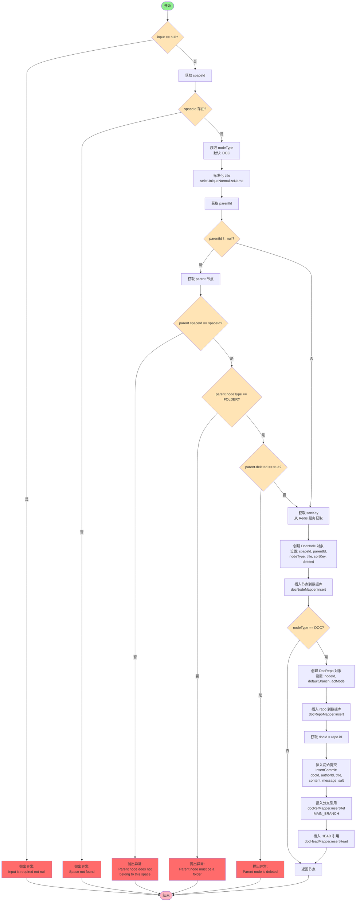

# createNode 流程图

## 方法说明

`createNode` 方法用于在文档系统中创建新节点，主要流程如下：

1. **参数校验**：检查输入对象是否为 null
2. **空间验证**：验证 spaceId 是否存在
3. **节点类型**：获取节点类型（默认为 DOC）
4. **标题处理**：标准化并唯一化标题
5. **父节点验证**（如果有 parentId）：
   - 验证父节点属于同一空间
   - 验证父节点是文件夹类型
   - 验证父节点未被删除
6. **排序键**：从 Redis 服务获取排序键
7. **创建节点**：创建并插入 DocNode 记录
8. **如果是文档类型**：
   - 创建 DocRepo 记录
   - 插入初始提交（init commit）
   - 创建 MAIN_BRANCH 分支引用
   - 创建 HEAD 引用
